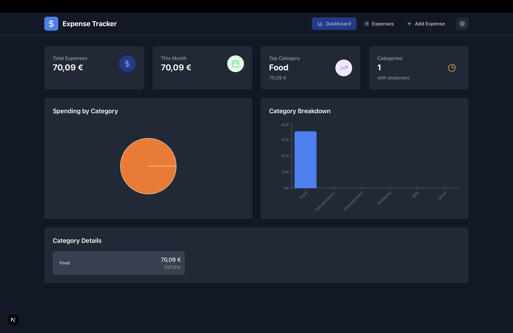
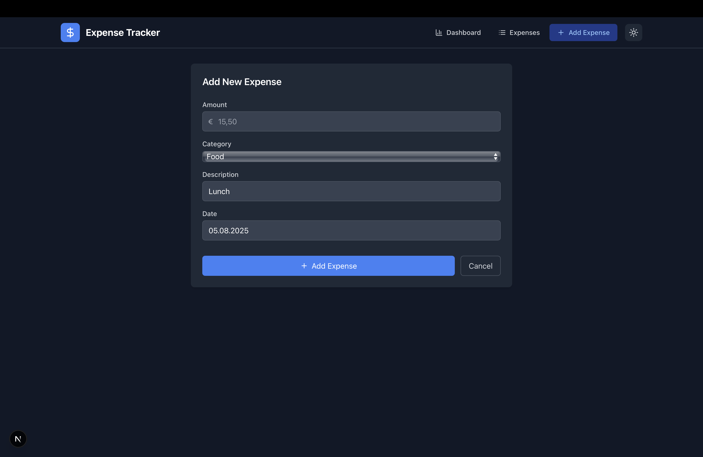
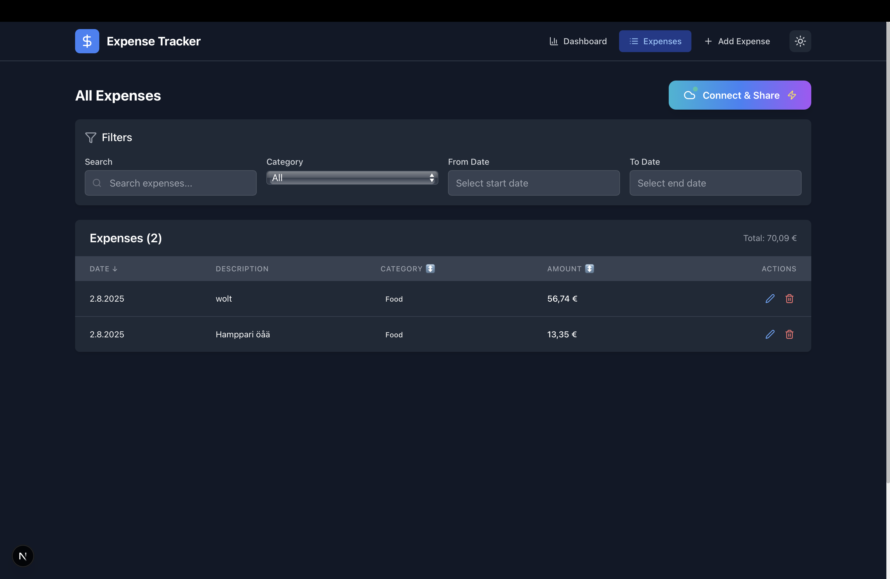

# How to Add an Expense

This guide will walk you through adding expenses to your expense tracker application. The add expense feature allows you to record your spending with detailed information and Finnish formatting support.

## Getting Started

### Accessing the Add Expense Form

1. **Open the Application**: Navigate to your expense tracker in your web browser
2. **Click the "Add" Tab**: Look for the navigation bar at the top of the page and click on the "Add" tab
3. **Form Appears**: The add expense form will be displayed with all the necessary fields

*Application navigation bar showing Dashboard, Expenses, and Add tabs with the expense tracker interface*

## Step-by-Step Guide

### Filling Out the Expense Form

The expense form contains four main fields that need to be completed:

#### 1. Amount Field
- **What it is**: The cost of your expense in Euros
- **Format**: Use Finnish number format with comma as decimal separator
- **Examples**: 
  - `15,50` for €15.50
  - `123,00` for €123.00
  - `5,99` for €5.99
- **Tips**: 
  - Don't include the € symbol (it's added automatically)
  - Use comma (,) not period (.) for decimals
  - Maximum 2 decimal places

*Amount field showing Finnish format with Euro symbol and comma decimal separator*

#### 2. Category Selection
Choose from the following predefined categories:

- **Food**: Groceries, restaurants, snacks, beverages
- **Transportation**: Gas, public transport, parking, car maintenance
- **Entertainment**: Movies, concerts, games, subscriptions
- **Shopping**: Clothing, electronics, household items
- **Bills**: Utilities, rent, insurance, phone bills
- **Other**: Any expense that doesn't fit the above categories

**Tip**: Choose the most relevant category to help with expense tracking and analysis later.

*Category dropdown showing available expense categories: Food, Transportation, Entertainment, Shopping, Bills, Other*

#### 3. Description Field
- **What it is**: A brief description of what you purchased or paid for
- **Required**: This field cannot be empty
- **Examples**:
  - "Lunch at downtown café"
  - "Monthly gym membership"
  - "New winter jacket"
  - "Electricity bill - January"

**Best Practices**:
- Be specific but concise
- Include location or vendor when relevant
- Use consistent naming for recurring expenses

*Description field with example text showing clear, concise expense description*

#### 4. Date Selection
- **Default**: Today's date is automatically selected
- **Format**: Finnish date format (DD.MM.YYYY)
- **Limitation**: You can only select today's date or earlier (no future dates)
- **How to Change**: Click on the date field to open the calendar picker

**Tips**:
- For expenses from previous days, click the calendar icon
- Navigate through months using the arrow buttons
- Double-check the date before submitting

*Date picker showing Finnish date format (DD.MM.YYYY) with calendar selection*

## Adding Your Expense

### Final Steps

1. **Review Your Information**: Double-check all fields are filled correctly
2. **Click "Add Expense"**: The blue button at the bottom of the form
3. **Success**: The form will clear and reset for your next entry
4. **Automatic Redirect**: You'll be taken back to your expense list to see the new entry

*The Add New Expense form interface showing all input fields: Amount (with € symbol), Category dropdown, Description text field, Date picker, and the blue "Add Expense" button with Cancel option*

## Editing Existing Expenses

### How to Edit an Expense

1. **Go to Expenses Tab**: Click on "Expenses" in the navigation
2. **Find Your Expense**: Locate the expense you want to modify
3. **Click Edit**: Look for the edit button (pencil icon) next to the expense
4. **Form Opens**: The add expense form opens with pre-filled information
5. **Make Changes**: Modify any field as needed
6. **Click "Update Expense"**: The button text changes when editing

*Expenses list view showing all recorded expenses with details like amount, category, description, and date, along with edit/delete options for each entry*

## Form Validation and Error Messages

### Common Validation Messages

The form will show helpful error messages if something is incorrect:

#### Amount Errors
- **"Please enter an amount"**: The amount field is empty
- **"Please enter a valid amount (e.g., 15,50)"**: Wrong format used (likely used period instead of comma)
- **"Amount must be greater than 0"**: Negative or zero amounts are not allowed

#### Description Errors
- **"Please enter a description"**: The description field is empty

#### Date Errors
- **"Please select a date"**: No date was selected

### How to Fix Errors
- **Red borders** around fields indicate errors
- **Error messages** appear below problematic fields
- **Fix the issues** and the errors will disappear automatically
- **Resubmit** the form once all errors are resolved

*Form displaying validation errors with red borders and error messages below problematic fields*

## Tips and Best Practices

### For Better Expense Tracking

1. **Be Consistent**: Use similar descriptions for recurring expenses
2. **Add Expenses Promptly**: Enter expenses soon after making them
3. **Use Appropriate Categories**: This helps with analysis and budgeting
4. **Include Details**: More specific descriptions help you remember what you bought

### Finnish Format Reminders

- **Always use commas** for decimal places (15,50 not 15.50)
- **Don't add currency symbols** (the € is added automatically)
- **Use the DD.MM.YYYY date format** (Finnish standard)

### Keyboard Shortcuts

- **Tab**: Move between form fields
- **Enter**: Submit the form (when all fields are valid)
- **Escape**: Close the form (if opened as a modal)

## Troubleshooting

### Common Issues and Solutions

#### "My decimal numbers don't work"
- **Problem**: Using period (.) instead of comma (,) for decimals
- **Solution**: Change `15.50` to `15,50`

#### "I can't select future dates"
- **Problem**: The date picker prevents future date selection
- **Solution**: This is intentional - only current and past dates are allowed

#### "The form won't submit"
- **Problem**: There are validation errors
- **Solution**: Look for red-bordered fields and error messages, fix them first

#### "My description is too long"
- **Problem**: Very long descriptions might cause display issues
- **Solution**: Keep descriptions concise and under 100 characters

### Getting Help

If you encounter issues not covered here:
1. Check that all required fields are filled
2. Verify the Finnish number format (comma for decimals)
3. Ensure you're using a supported web browser
4. Try refreshing the page and entering the expense again

## What Happens After Adding an Expense

### Where Your Data Goes

- **Local Storage**: Your expenses are saved in your browser's local storage
- **Automatic Saving**: No need to manually save - it happens automatically
- **Data Persistence**: Your expenses will remain even after closing the browser
- **Export Options**: You can export your data using the export features

### Viewing Your Expenses

After adding an expense:
- Go to the **"Expenses"** tab to see all your entries
- Go to the **"Dashboard"** tab to see summaries and charts
- Use the **filter options** to find specific expenses
- **Export your data** for backup or analysis in other applications

---

## Related Information

- **For Developers**: Technical implementation details can be found in the [Developer Documentation](../dev/add-expense-implementation.md)
- **Export Features**: Learn how to export your data in various formats
- **Dashboard**: Understanding your expense summaries and charts

---

**Need More Help?** Check our FAQ or contact support through the application.

*Last Updated: Generated with Claude Code*