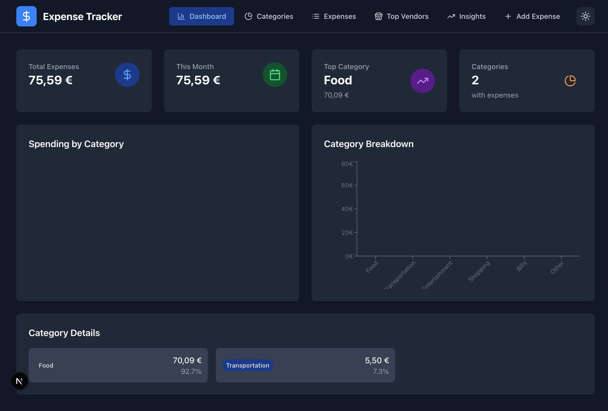
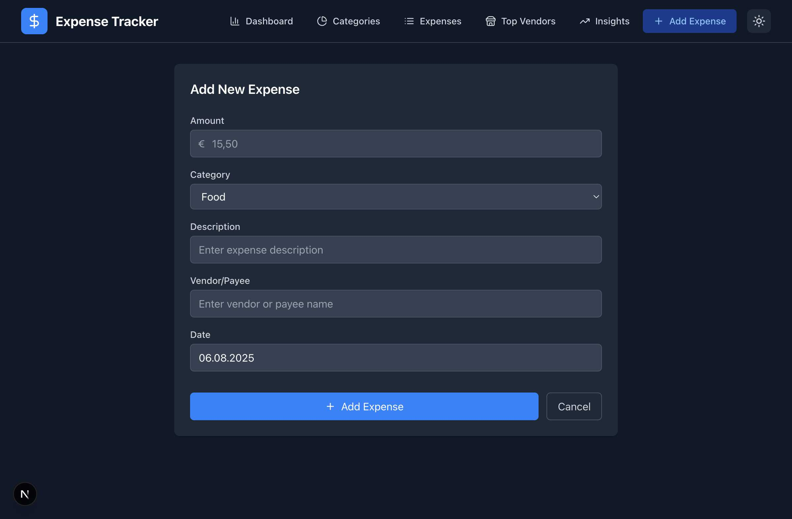
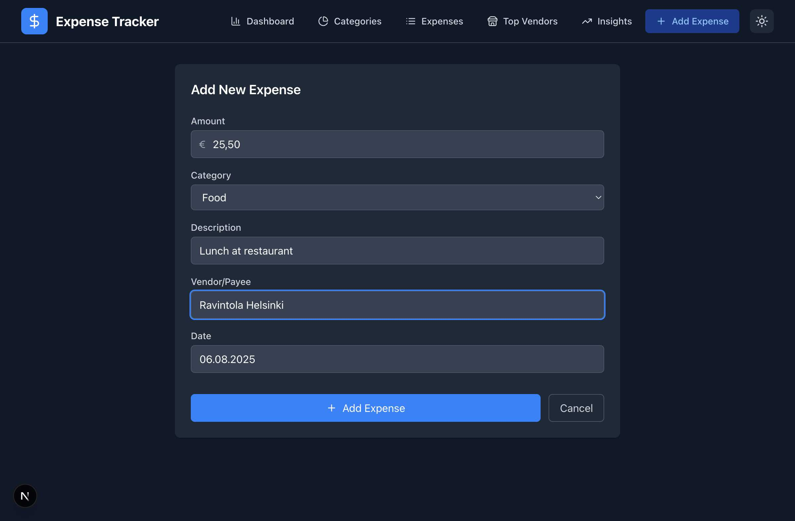
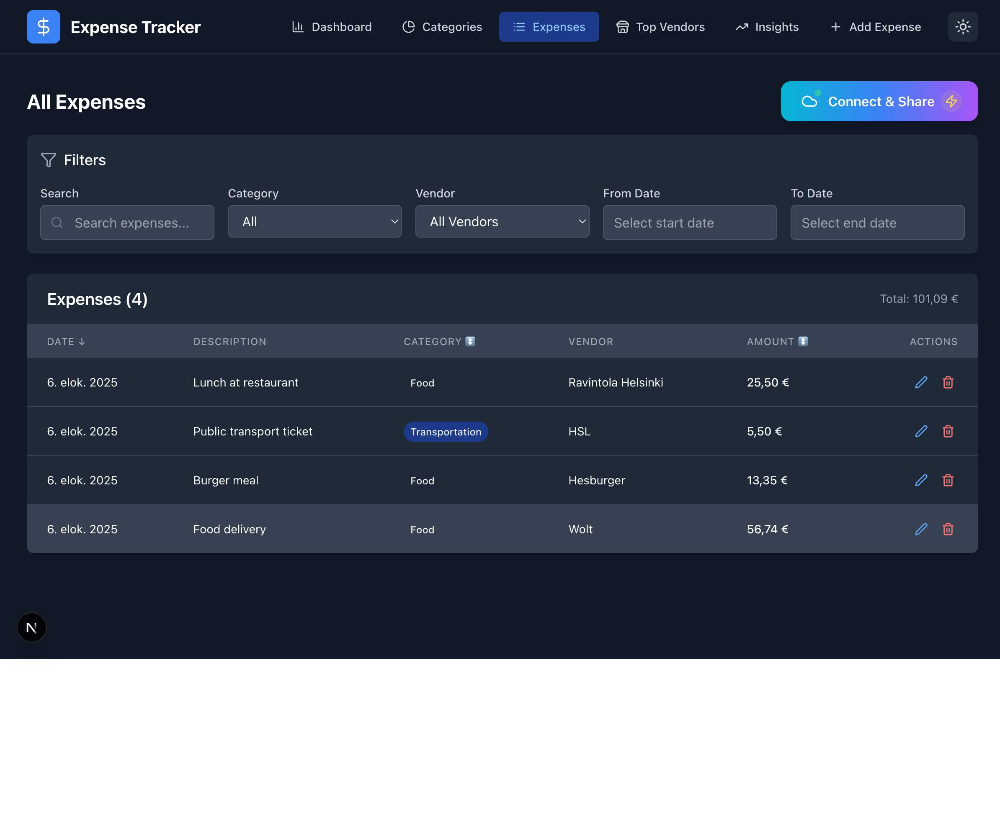
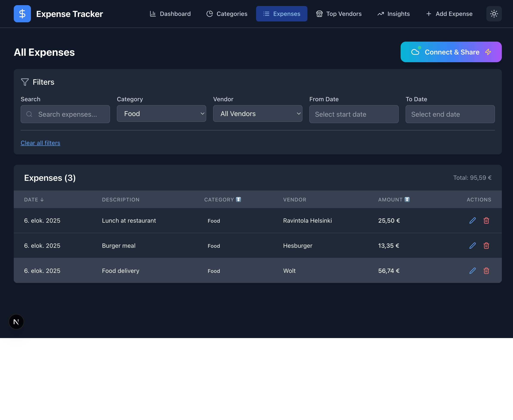
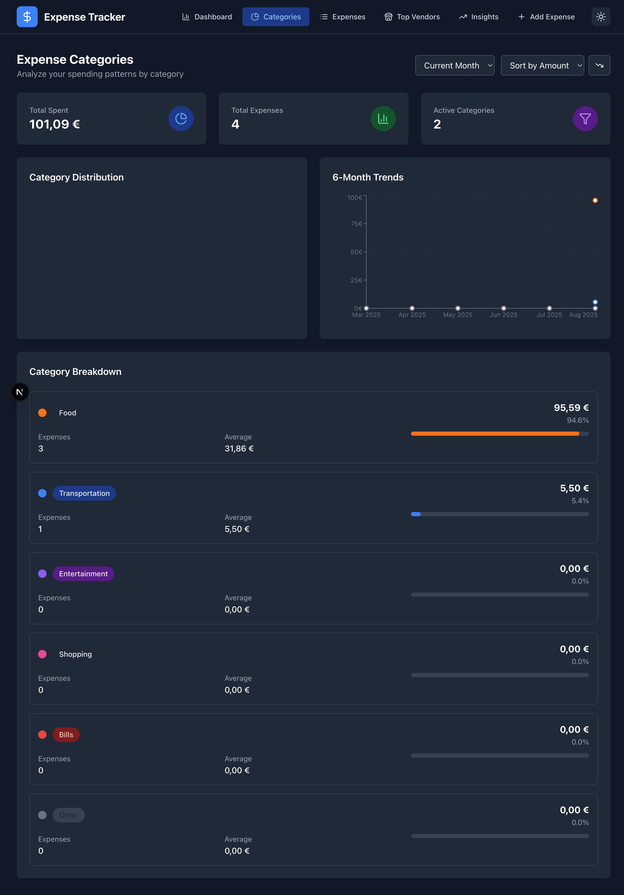
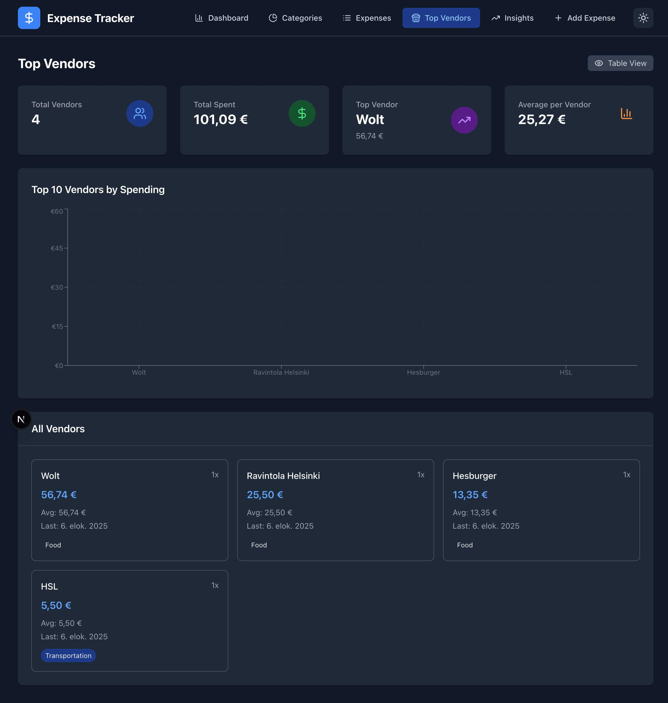

# How to Use Expense Tracking

**Last Updated:** 2025-01-08

## What is Expense Tracking?

The expense tracking system helps you manage your personal expenses by providing tools to add, edit, view, and analyze your spending. The application supports Finnish formatting (using commas for decimals and euros as currency) and includes features for categorizing expenses, tracking vendors, and generating insights about your spending patterns.

## Getting Started

When you open the application, you'll see the main dashboard with an overview of your expenses. From here, you can navigate to different sections using the navigation menu at the top.

### Main Features Available
- **Dashboard**: Overview of your spending with key statistics
- **Categories**: See expenses broken down by category with charts
- **Expenses**: View and manage your expense list with filtering
- **Top Vendors**: Analyze spending by vendor/payee
- **Insights**: Monthly trends and analytics
- **Add Expense**: Create new expense entries

## Adding a New Expense

### Step 1: Navigate to Add Expense
1. Click on the "Add Expense" tab in the navigation menu
2. The expense form will appear

### Step 2: Fill in Expense Details

**Amount**
- Enter the expense amount using Finnish format with comma as decimal separator
- Example: `25,50` for 25 euros and 50 cents
- The € symbol is automatically displayed

**Category**
Choose from predefined categories:
- **Food**: Restaurant meals, groceries, cafes
- **Transportation**: Public transport, fuel, parking
- **Entertainment**: Movies, concerts, hobbies
- **Shopping**: Clothing, electronics, general purchases
- **Bills**: Utilities, rent, subscriptions
- **Other**: Miscellaneous expenses

**Description**
- Enter a clear description of the expense
- Example: "Lunch at restaurant" or "Monthly bus pass"

**Vendor/Payee**
- Enter the name of the business or person you paid
- Example: "Ravintola Helsinki" or "HSL"

**Date**
- Select the date when the expense occurred
- Use the date picker or enter date manually in DD.MM.YYYY format
- You cannot select future dates

### Step 3: Save the Expense

1. Click the "Add Expense" button
2. The expense will be saved and you'll return to the expenses list
3. Click "Cancel" if you want to discard the entry

## Viewing and Managing Expenses

### Accessing Your Expense List
1. Click on "Expenses" in the navigation menu
2. You'll see a list of all your expenses with filtering options and summary information

### Understanding the Expense List

**Header Information**
- Total number of expenses shown in brackets
- Sum of all displayed expenses (updates based on filters)
- Export button for downloading data

**Expense Details**
Each expense shows:
- Date (in Finnish format: dd.MM.yyyy)
- Description
- Category (with color-coded badges)
- Vendor/Payee
- Amount in euros
- Action buttons (edit and delete)

### Filtering and Searching Expenses

The filter panel helps you find specific expenses:

**Search Box**
- Enter any text to search across descriptions, categories, vendors, and amounts
- Search is case-insensitive and matches partial text

**Category Filter**
- Select "All" to see all categories
- Choose a specific category to see only those expenses

**Vendor Filter**
- Select "All Vendors" to see expenses from all vendors
- Choose a specific vendor to filter by that vendor only

**Date Range Filters**
- Set "From Date" and "To Date" to view expenses in a specific period
- Use the date pickers for easy selection
- Leave fields empty to include all dates

### Sorting Expenses

Click on column headers to sort:
- **Date**: Sort by expense date (most recent first by default)
- **Amount**: Sort by expense amount (highest first by default)
- **Category**: Sort alphabetically by category

Look for arrows (↑↓) to see current sort direction. Click the same header again to reverse the sort order.

### Managing Individual Expenses

**Editing Expenses**
1. Click the pencil icon (✏️) next to any expense
2. The expense form opens with current values pre-filled
3. Make your changes
4. Click "Update Expense" to save changes
5. Click "Cancel" to discard changes

**Deleting Expenses**
1. Click the trash icon (🗑️) next to any expense
2. A confirmation dialog appears
3. Click "OK" to confirm deletion or "Cancel" to keep the expense

⚠️ **Warning**: Deleted expenses cannot be recovered.

## Analyzing Categories

### Category Overview
1. Click "Categories" in the navigation menu
2. See a comprehensive breakdown of your spending by category

### Category Features

**Summary Cards**
- **Total Spent**: Sum of all expenses across categories
- **Total Expenses**: Total number of expense entries
- **Active Categories**: Number of categories that have expenses

**Category Distribution Chart**
- Visual pie chart showing proportion of spending by category
- Color-coded to match category badges throughout the application

**6-Month Trends**
- Line chart showing spending trends over the past 6 months
- Helps identify spending patterns over time

**Category Breakdown**
Detailed information for each category:
- Total amount spent in that category
- Percentage of total spending
- Number of expenses in that category
- Average expense amount for that category

### Category Options

**Time Period Selection**
- Current Month (default)
- Last Month
- Last 3 Months
- All Time

**Sorting Options**
- Sort by Amount (default)
- Sort by Percentage
- Sort by Count (number of expenses)

### Category Colors
- **Food**: Orange
- **Transportation**: Blue  
- **Entertainment**: Purple
- **Shopping**: Pink
- **Bills**: Red
- **Other**: Gray

## Analyzing Vendors

### Vendor Analysis
1. Click "Top Vendors" in the navigation menu
2. See detailed analysis of your spending by vendor/payee

### Vendor Features

**Summary Statistics**
- **Total Vendors**: Number of unique vendors you've paid
- **Total Spent**: Sum of all vendor payments
- **Top Vendor**: Your highest spending vendor with amount
- **Average per Vendor**: Average spending across all vendors

**Top 10 Chart**
- Bar chart showing your top vendors by total spending
- Quickly identify where most of your money goes

**All Vendors List**
Detailed cards for each vendor showing:
- Vendor name
- Total amount spent with this vendor
- Number of transactions (1x, 2x, etc.)
- Average transaction amount
- Date of last transaction
- Primary category for this vendor's expenses

### Using Vendor Information

**Identify Spending Patterns**
- Find your most expensive vendors
- Track subscription services and recurring payments
- Compare average transaction amounts between vendors

**Budget Planning**
- Identify vendors where you might reduce spending
- Track business expenses separately from personal ones
- Monitor seasonal spending patterns

## Monthly Insights

### Accessing Insights
1. Click "Insights" in the navigation menu
2. View monthly spending trends and detailed analytics

### Available Insights
- Monthly spending totals over time
- Category trends by month
- Comparison with previous months
- Spending pattern analysis
- Budget tracking and goals

## Exporting Your Data

### Export Options
1. From the "Expenses" view, click the "Connect & Share" button
2. Access the Cloud Export Hub
3. Choose from various export and sharing options

### Export Features
- **CSV Export**: Download all expense data for use in Excel/Google Sheets
- **Cloud Integration**: Connect to Google Sheets, Dropbox, and other services
- **Team Sharing**: Generate shareable links for collaboration
- **Automated Exports**: Set up recurring exports to cloud services

### What's Included in Export
- All expense data (or filtered subset if filters are active)
- Date, amount, category, description, vendor
- Finnish formatting preserved where appropriate

### Using Exported Data
- Open in Excel or Google Sheets for advanced analysis
- Import into accounting software
- Create backups of your expense data
- Share with accountants or financial advisors

## Tips & Best Practices

### Consistent Data Entry

**Vendor Names**
- Use consistent vendor names ("Ravintola Helsinki" not "ravintola helsinki" or "R. Helsinki")
- This ensures accurate vendor analysis and filtering

**Descriptions**
- Write clear, descriptive expense descriptions
- Include relevant details but keep them concise
- Examples: "Weekly groceries", "Lunch meeting with client", "Monthly gym membership"

**Categories**
- Be consistent with category selection
- Use "Other" sparingly - try to fit expenses into main categories
- Consider your own spending patterns when choosing categories

### Regular Data Maintenance

**Weekly Reviews**
- Enter expenses regularly to avoid forgetting details
- Review and correct any mistakes early
- Check for duplicate entries

**Monthly Analysis**
- Use category and vendor analysis to understand spending patterns
- Identify opportunities to reduce expenses
- Track progress toward spending goals

### Effective Search and Filtering

**Search Tips**
- Use partial words (search "rest" to find all restaurants)
- Try different spelling variations for better results
- Search in specific filter fields instead of general search for precise results

**Filter Combinations**
- Combine multiple filters for precise results
- Use date ranges to analyze spending in specific periods
- Clear all filters to return to complete expense list

### Finnish Number Format

**Correct Format**
- Always use comma for decimals: `15,50` not `15.50`
- Examples: `25,00`, `123,45`, `5,50`

**Common Mistakes**
- Don't use periods for decimals
- Don't leave incomplete decimals like `15,`
- The system will show validation errors for incorrect formats

## Troubleshooting

### Common Issues

**"Please enter a valid amount" Error**
- **Cause**: Incorrect decimal separator
- **Solution**: Use comma (,) instead of period (.)
- **Correct**: `15,50`, `100,00`
- **Incorrect**: `15.50`, `15,`

**Expense Not Showing in List**
- **Check filters**: Clear all filters to see complete list
- **Verify save**: Check if expense was actually saved (look at total count)
- **Refresh page**: Sometimes a browser refresh helps

**Date Picker Issues**
- **Future dates**: The system prevents future dates by design
- **Format**: Ensure you're using DD.MM.YYYY format
- **Selection**: Make sure you've actually selected a date

**Search Not Working**
- **Clear filters**: Other filters might be conflicting
- **Try shorter terms**: Use partial words instead of complete phrases
- **Check spelling**: Try different variations or simpler terms

**Export Problems**
- **Browser settings**: Check download permissions
- **File access**: Ensure you can save files to Downloads folder
- **Try different browser**: If issues persist

### Getting Better Results

**Improve Organization**
- Develop consistent naming conventions early
- Use descriptive but concise expense descriptions
- Regular cleanup of vendor names and categories

**Better Search Results**
- Use shorter, more general search terms
- Try searching in specific fields rather than general search
- Use category and vendor filters to narrow results

**Data Quality**
- Enter expenses promptly while details are fresh
- Double-check amounts and categories before saving
- Regularly review and clean up data

## Advanced Features

### Keyboard Shortcuts
- **Tab**: Navigate between form fields
- **Enter**: Submit forms or confirm actions
- **Escape**: Close modals or cancel actions

### Mobile Usage
- The application is fully responsive and works on mobile devices
- Touch-friendly interface with appropriate button sizes
- Simplified layout for smaller screens

### Data Privacy
- All data is stored locally in your browser
- No information is sent to external servers
- Regular browser data clearing will remove expense data
- Consider regular exports as backups

## Need Help?

### Additional Resources
- [Developer Documentation](../dev/expense-tracking-implementation.md) - Technical details about how the system works
- Check browser console for error messages if something isn't working
- Try refreshing the page if you encounter unexpected behavior

### Data Backup
**Important**: All expense data is stored locally in your browser. Consider regular exports as backups, especially:
- Before clearing browser data
- When switching devices
- Before major browser updates
- As part of regular data management

### Support
- Report issues through the application's feedback system
- Check for updates to ensure you have the latest features
- Consider browser compatibility if experiencing issues

---

**Remember**: The expense tracker is designed to be simple and intuitive. Most features work exactly as you'd expect, and the Finnish number formatting ensures accurate financial calculations for European users.